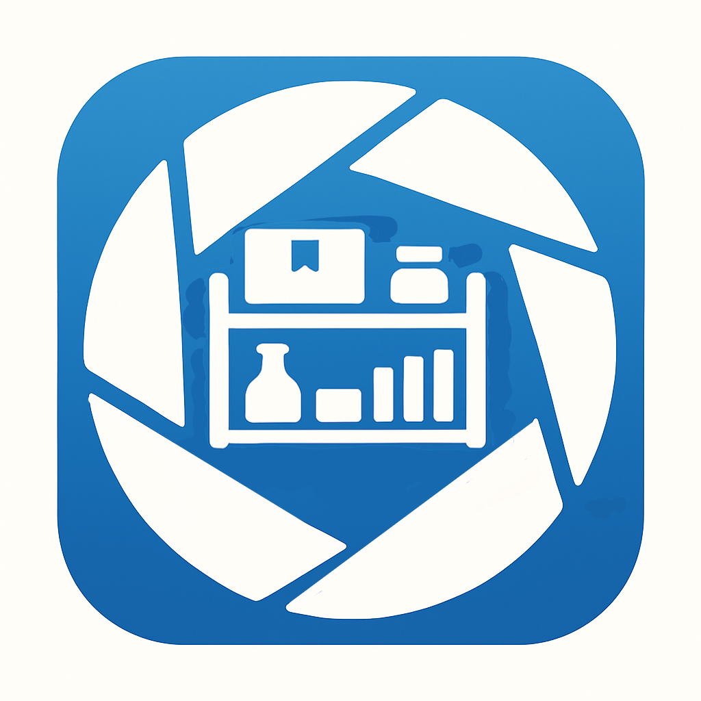

<link rel="stylesheet" href="{{ '/assets/css/custom.css?v=7' | relative_url }}">

<!-- App Logo -->

  

<!-- DOWNLOAD AREA -->

  

    <!-- Google Play badge -->
    

   <!-- Windows download button (segmented, matches original) -->
<!-- 
-->
  

<!-- === Sellventory navigation buttons === -->

  <a class="sv-btn" href="/">Peacheybyte Studios Home</a>
  <a class="sv-btn" href="{{ site.baseurl }}/user-guide/">User Guide</a>
  <a class="sv-btn" href="{{ site.baseurl }}/changelog/">Change Log</a>
  <a class="sv-btn" href="{{ site.baseurl }}/issues/">Known Issues</a>
  <a class="sv-btn" href="{{ site.baseurl }}/roadmap/">Planned Additions</a>

<!-- === end navigation buttons === -->

<!-- Body -->
Inventory made simple — for buyers, sellers, and collectors.

The Collection Curator is built for buyers, sellers, and collectors who want a clear, reliable way to keep track of their items. Whether you are reselling at markets, managing an online store, or curating a personal collection, The Collection Curator helps you stay organised without relying on complicated tools or cloud accounts.

With The Collection Curator  you can:

- **Record your items with photos and details.** Each entry can store a picture, purchase price, notes, and custom tags, giving you a complete view of what you own or intend to sell.
- **Organise by tags and locations.** Group items by category, storage box, shelf, or any system that suits your workflow, so nothing gets lost or overlooked.
- **Track purchases and sales.** Know exactly when and where you bought an item, what you paid, and the final selling price. This makes it easy to calculate your profit and spot trends in what moves quickly.
- **Generate reports and exports.** Create spreadsheets for analysis, backup your records, or share summaries when you need them. Exporting is straightforward and works the same way across Android and the Companion desktop app.
- **Use the Windows & Linux Companion.** Coming Soon! Work with your database on a bigger screen, making editing, browsing, and reporting faster and more comfortable.

Everything is stored locally — no logins, no hidden syncs, and no internet required. Sellventory is designed to be lightweight, dependable, and under your control.

---

